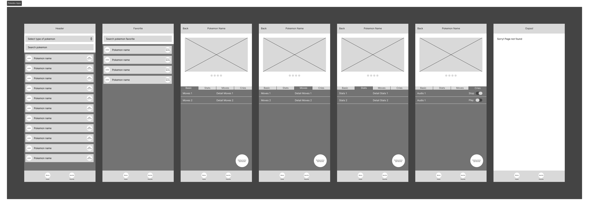

# Pokedex

## Description

The applicant is to program a simple application for Pokédex. A Pokédex is a digital encyclopedia created by Professor Oak as an invaluable tool to Trainers in the Pokémon
world. It gives information about all Pokémon in the world that are contained in its database..

## Prerequisites

* Node.js (v18 or higher)
* Angular CLI (v19.0.0 or higher)
* Ionic CLI (v7 or higher)

## Installation

1. Clone the repository:

```bash
git clone https://github.com/afifalfiano/pokedex
```

2. Navigate to the project directory:

```bash
cd pokedex
```

3. Install dependencies:

```bash
npm install
```

## Running the Application

To start the development server with Angular, run:

```bash
ng serve
```

Then, open your browser at `http://localhost:4200`

Or to run with Ionic, use:

```bash
ionic serve
```

Then, open your browser at `http://localhost:8100`

Or to run with Ionic Capacitor Android, use:

```bash
npx cap run android 
```

Then, open your android emulator

Or to run with Ionic Capacitor Android, use:

```bash
npx cap run ios 
```

Then, open your iOS emulator

## Building the Project

To build the project for production with Angular, run:

```bash
ng build
```

Or with Ionic, use:

```bash
ionic build
```

## Running Tests

To execute unit tests, run:

```bash
ng test
```

## Additional Information.



Link Figma: [Prototype Pokedex Apps](https://www.figma.com/design/jQ5vyMygSJBMaqToMsMi1D/Pokedex-Apps?node-id=8-19&t=VVIdJvqZwa2mxpfz-1)


## Additional Information.

- Web Apps: **Download file inside the foldder results-build/web-pokodex.zip** or you can access directly to **https://pokedex-14d36.web.app**
- APK: **Download file inside the foldder results-build/apk-pokodex.zip**
- IOS: **Download file inside the foldder results-build/ios-pokodex.zip**
